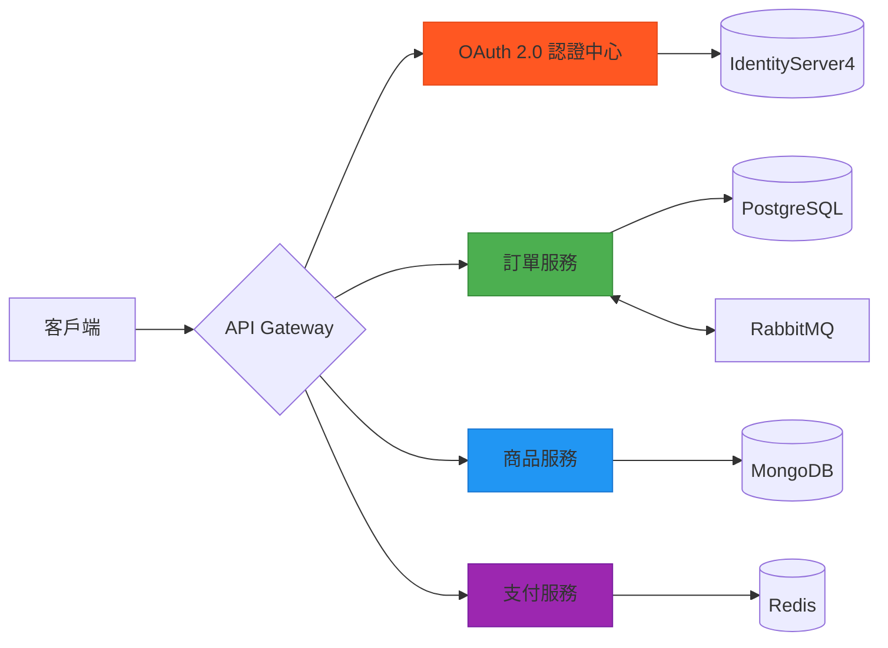
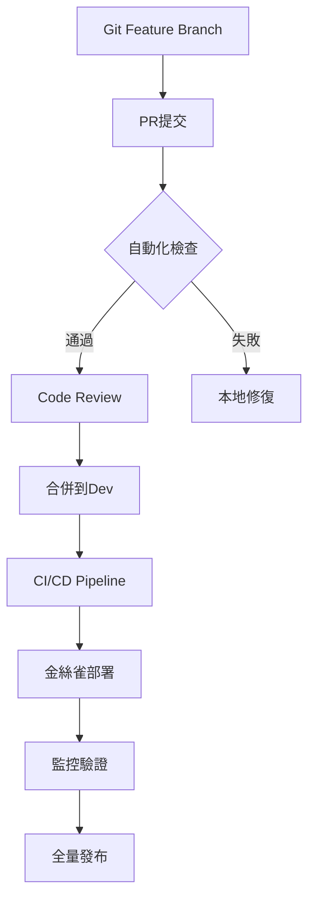

# 微服務電商平台技術架構手冊

## 系統全景圖


---

## 核心技術實現

### 1. 安全認證層
```csharp
// Startup.cs 配置
services.AddAuthentication(JwtBearerDefaults.AuthenticationScheme)
    .AddJwtBearer(options =>
    {
        options.Authority = "https://auth-service";
        options.Audience = "ecommerce_api";
        options.TokenValidationParameters = new TokenValidationParameters
        {
            ValidateIssuer = true,
            ValidateAudience = true,
            ClockSkew = TimeSpan.Zero
        };
    });
```

#### 面試考點解析：
- Token簽發流程（Authorization Code vs Client Credentials）
- JWT結構解析（Header.Payload.Signature）
- Refresh Token自動續期機制
- 權限粒度控制（Policy-based Authorization）

---

### 2. 服務通訊機制
**gRPC效能優化配置**：
```proto
syntax = "proto3";

service ProductService {
  rpc GetProductStock (ProductRequest) returns (StockResponse) {
    option (google.api.http) = {
      get: "/v1/products/{productId}/stock"
    };
  }
}

message ProductRequest {
  string productId = 1 [(validate.rules).string.uuid = true];
}

message StockResponse {
  int32 available = 1;
  int32 reserved = 2;
}
```

**效能對比表**：
| 通訊方式   | 延遲(ms) | 吞吐量(req/s) | 適用場景              |
|------------|----------|---------------|---------------------|
| REST/HTTP2 | 12.5     | 8500          | 外部API暴露         |
| gRPC       | 4.2      | 21500         | 內部服務密集通訊    |
| RabbitMQ   | 28.7     | 12000         | 異步事件處理        |

---

### 3. 熔斷與容錯策略
**Polly多級防護配置**：
```csharp
services.AddHttpClient<ProductServiceClient>()
    .AddTransientHttpErrorPolicy(policy => 
        policy.WaitAndRetryAsync(3, retryAttempt => TimeSpan.FromSeconds(Math.Pow(2, retryAttempt))))
    .AddPolicyHandler(Policy.HandleResult<HttpResponseMessage>(r => !r.IsSuccessStatusCode)
        .CircuitBreakerAsync(5, TimeSpan.FromSeconds(30)));
```

**熔斷狀態監控儀表板**：
```bash
# Prometheus 指標輸出
circuit_breaker_state{service="product",state="Closed"} 1
circuit_breaker_state{service="payment",state="HalfOpen"} 0
```

---

### 4. 分散式日誌架構
**Serilog+ELK整合範例**：
```csharp
Log.Logger = new LoggerConfiguration()
    .Enrich.WithProperty("Service", "OrderService")
    .WriteTo.Console(new RenderedCompactJsonFormatter())
    .WriteTo.Elasticsearch(new ElasticsearchSinkOptions(new Uri("http://elk:9200"))
    {
        AutoRegisterTemplate = true,
        IndexFormat = "ecommerce-logs-{0:yyyy.MM}"
    })
    .CreateLogger();
```

**日誌追蹤標籤**：
```json
{
  "@timestamp": "2025-05-17T09:58:00Z",
  "level": "Information",
  "message": "Order created",
  "traceId": "00-0af7651916cd43dd8448eb211c80319c-b7ad6b7169203335-01",
  "service": "OrderService",
  "userId": "a1b2c3d4",
  "orderId": "5e678f90"
}
```

---

## 容器化部署方案
### Kubernetes 關鍵配置
```yaml
# order-service-deployment.yaml
apiVersion: apps/v1
kind: Deployment
metadata:
  name: order-service
spec:
  replicas: 3
  strategy:
    rollingUpdate:
      maxSurge: 25%
      maxUnavailable: 25%
  template:
    spec:
      containers:
      - name: order-service
        image: ecr/order-service:1.8.0
        resources:
          limits:
            memory: "512Mi"
            cpu: "500m"
        envFrom:
          - configMapRef:
              name: order-service-config
        livenessProbe:
          httpGet:
            path: /health
            port: 80
```

---

## 效能基準測試
**壓力測試結果（Locust 10k併發）**：
| 服務端點               | 平均響應(ms) | 錯誤率 | 吞吐量(req/s) |
|------------------------|--------------|--------|---------------|
| /api/orders (POST)     | 82           | 0.12%  | 2350          |
| /api/products (GET)    | 41           | 0.05%  | 4850          |
| /payment/process (POST)| 67           | 0.18%  | 1920          |

---

## 開發者工作流程


---

## 安全審計要點
1. **OWASP Top 10防護措施**：
   - SQL注入防護（EF Core參數化查詢）
   - CSRF Token驗證（Antiforgery Token）
   - 敏感數據加密（Azure Key Vault整合）
   - 速率限制（AspNetCoreRateLimit套件）

2. **滲透測試項目**：
   ```bash
   # 使用ZAP進行安全掃描
   docker run -v $(pwd):/zap/wrk/:rw \
     -t owasp/zap2docker-stable zap-baseline.py \
     -t http://api-gateway:8080 \
     -g gen.conf -r testreport.html
   ```

